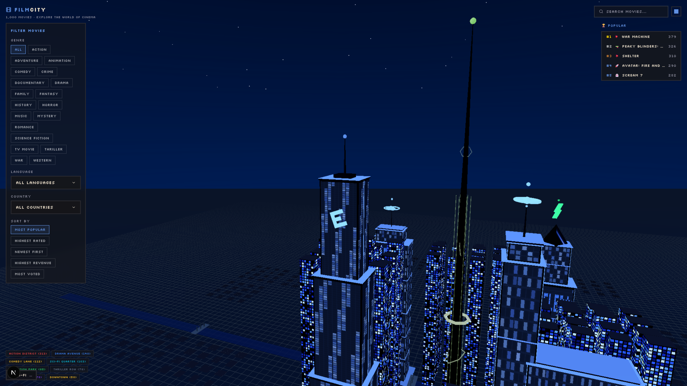

<h1 align="center">Cineverse</h1>

<p align="center">
  <strong>Explore movies from around the world as buildings in a 3D pixel art city.</strong>
</p>

---


## What is Cineverse?

Cineverse transforms movie data into a unique pixel art city skyline. The more popular a movie is, the taller its building grows. Explore an interactive 3D city, fly between buildings, filter by genre, language, or country, and discover your next favorite film.

## Features

- **3D Pixel Art Buildings** — Each movie becomes a building with height based on popularity, width based on votes, and lit windows representing rating
- **Filtering System** — Dynamically filter the 3D city by Movie Genre, Language, and Country
- **Free Flight Mode** — Fly through the city with smooth camera controls, visit any building, and explore the skyline
- **Movie Profiles** — Click on any building to view movie details, including the poster, synopsis, release date, and TMDB links
- **Instant Caching** — Movie data is cached locally via the browser Cache API for instant 3D layout loading on returning visits

## How Buildings Work

| Metric         | Affects           | Example                                |
|----------------|-------------------|----------------------------------------|
| Popularity     | Building height   | High popularity → taller building      |
| Vote Count     | Building width    | More votes → wider base                |
| Rating         | Window brightness | Higher rating → more lit windows       |
| Genre          | City District     | Action movies group in Action District |

Buildings are rendered with instanced meshes and a LOD (Level of Detail) system for performance. Close buildings show full detail with animated windows; distant buildings use simplified geometry.

## Tech Stack

- **Framework:** [Next.js](https://nextjs.org) 16 (App Router, Turbopack)
- **3D Engine:** [Three.js](https://threejs.org) via [@react-three/fiber](https://github.com/pmndrs/react-three-fiber) + [drei](https://github.com/pmndrs/drei)
- **Data Source:** [The Movie Database (TMDB) API](https://www.themoviedb.org/)
- **Styling:** [Tailwind CSS](https://tailwindcss.com) v4 with pixel font (Silkscreen)
- **Hosting:** [Vercel](https://vercel.com)

## Getting Started

```bash
# Clone the repo
git clone https://github.com/karthik-n-p/cineverse.git
cd cineverse

# Install dependencies
npm install

# Set up environment variables

# Linux / macOS
cp .env.example .env.local

# Windows (Command Prompt)
copy .env.example .env.local

# Windows (PowerShell)
Copy-Item .env.example .env.local

# Fill in your TMDB token
```

Open `.env.local` and add your TMDB API Bearer Token:
```env
TMDB_BEARER_TOKEN="your_token_here"
```

To get a free token, sign up at [themoviedb.org/settings/api](https://www.themoviedb.org/settings/api).

```bash
# Run the dev server
npm run dev
```

Open [http://localhost:3001](http://localhost:3001) to see the city.

## Environment Setup

The only required environment variable is `TMDB_BEARER_TOKEN`. This is used to fetch movie data, genres, languages, and countries.

## License

[AGPL-3.0](LICENSE) — You can use and modify Cineverse, but any public deployment must share the source code.
